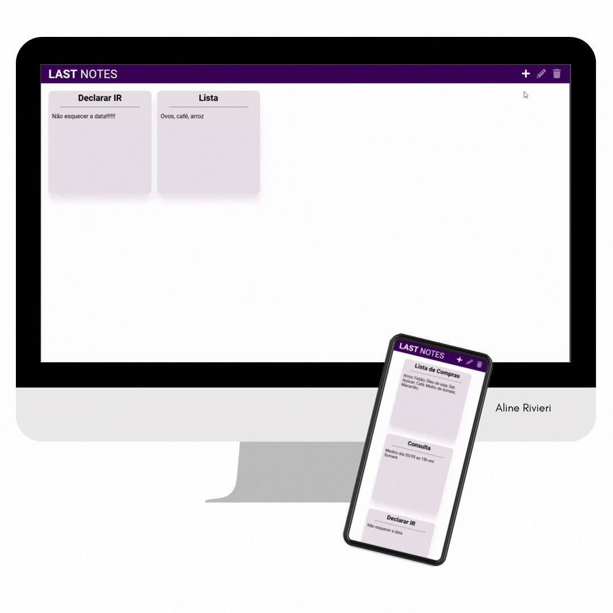

# Last Notes

## Getting Started React JS

My first project with ReactJS.

This project was based on the design created and made available via Youtube by https://www.youtube.com/c/Huriel/ 

⚒️ Technologies used:

- HTML
- CSS
- ReactJS

🤓 Learning:

- Using the concept of CRUD, useEffect, useState, useContext

📄 Requirements:

- Any operating system
- VS Code

📝 License:

-Free for use and change

💻 Result:

Veja a aplicação [aqui](https://)
